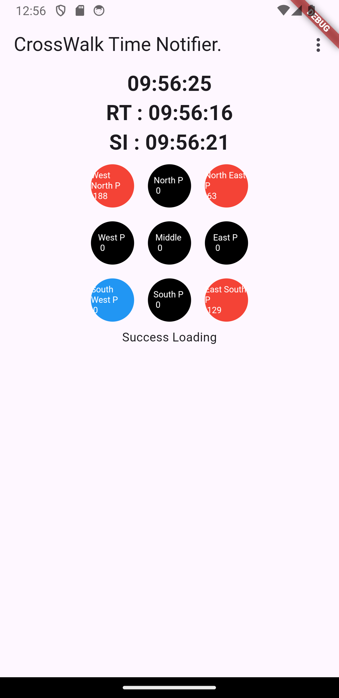

# crosswalk_time_notifier
# 보행자 횡단보도 잔여시간 알림이

본 프로젝트는 서울시 교차로의 신호 제어기에서 잔여시간 및 신호 정보 api를 이용하여 
보행자의 횡단보도 신호 잔여시간을 알려주는 어플리케이션이다. 

## rough한 어플리케이션 로직

1. DB에 서울시 내 교차로 id를 적재 
2. (지속적으로) 현재 위치 근방의 교차로 id를 탐색
3. 만약 근처의 교차로를 찾았다면 해당 교차로의 잔여시간 및 신호 정보를 api로 요청
4. 화면에 출력

## 현재 문제점 및 해결해야하는 상황 

### 문제점

결국 교차로의 일정 반경에 들어가게 되면 그 때부터 api를 요청하면서 해당 교차로 보행자 신호들의 잔여시간을 화면에 출력함. 
하지만 api 자체가 실시간 성을 보장 받기 어려운 rest api 이기 때문에 문제가 발생함. 

api를 요청하고 해당 정보를 화면에 출력하기 까지 지연시간 (api 요청 시간 + api 응답 데이터 처리 + 어플리케이션 실행 시간)은 불가피한데 이를 길어지면 길어질 수록 잔여시간을 표시하지 못하는 신호등이 늘어남. 

만일 보행자가 원하는 교차로의 원하는 횡단보도의 잔여시간이 표시되지 않는다면 현재 설치되어 있는 보행자 신호를 보여주는 (색을 출력하는 신호등) 과 현재 개발 중인 어플리케이션의 다른 점이 없음. 

예를 들어 만일 현재 시간과 api를 요청한 시점의 시간, 즉 지연시간 (api 요청 시간 + api 응답 데이터 처리 + 어플리케이션 실행 시간)이 5초라고 가정을 할 때, 우리가 제공 받은 데이터는 현재로부터 5초 이전의 데이터이기 때문에 우리는 5초 전의 정보를 가지고 있는 것이다. 
다만 모든 신호등의 잔여시간이 5초 이상이라면, 우리는 미리 지연시간을 예측하여 데이터를 요청해놓을 수도 있고 제공 받은 정보로부터 +5초 하여 화면에 출력하면 될 것이다. 

하지만 잔여시간이 5초 미만이거나 0초가 되었을 경우가 문제가 되는데 
5초 미만이라면 현재 신호 색의 변화만 표시할 수 있고 변화된 신호등의 잔여시간을 표시할 수 없음 (해당 필드값이 제공이 안됨)
또한 0초가 되었을 경우도 마찬가지이다. 

또한 신호가 "stop-And-Remain", "protected-Movement-Allowed", "permissive-Movement-Allowed" 이라는 신호가 존재하는데 
해당 설정 잔여시간이 얼마인지 모르기 때문에 정확한 시간의 변화를 화면에 표시하기는 어려울 수 있음 (다만 이는 아직까지는 고려사항이 아님)

  
따라서 해당 부분을 반드시 기능적으로 구현하여 처리해야함. 방법으로는 
1. Open Api를 제공하는 TDATA에게 신호 제어기에 세팅 되어 있는 총 잔여시간 정보를 제공 받음. 
(서울시의 모든 신호제어기는 유기적으로 얽혀있기에 고정된 잔여시간이라는 것은 존재할 수 없으나 우리는 극단적으로 기다리면 최대 3분, 즉 한 사이클을 기다리는 것이므로 해당 한 사이클의 이전 혹은 이후의 데이터를 제공 받는게 어렵지는 않을 것이라 예상됨. 다만 api 데이터를 개선 시켜줄 지는 의문인 부분, 현재는 신청해 놓은 상태)

2. api 요청시간, 이는 우리가 최적화 할 수 없는 고정된 부분이기에 데이터를 전처리 하는 과정이나 어플리케이션의 실행시간을 최적화 하여 해당 지연시간을 최소화 시킨다면, 잔여시간이 표시 되지 않는 신호등들을 확률 적으로 줄일 수 있을 것으로 예상됨. 
지연시간이 3초일 때와 지연시간이 10초 일때를 생각해보면 이해가 쉬움. 

다만 사용자가 많아지고 api를 계속해서 요청하다보면 서버에도 부담이 갈 수 있지 않을까 싶긴하다. 또한 api 요청시간도 서버의 상황에 따라 시시각각 달라지기에...
이는 현재 필수적인 고민은 아님. 

현재는 2번의 방법과 방향성을 선택한 상황이다. 

우선적으로는 모든 위젯 및 서비스의 실행시간을 표시하고 
이를 줄일 수 있는 방법을 모색하여 지연시간을 딜레이 시킨다. 

그리고 지연시간을 알아냈다면 해당 지연시간보다 잔여시간이 많은 경우나, 잔여시간이 지연시간 미만일 경우 등등을 가정하고 이를 통해서 api를 재호출 해야할 것이다.

### 추가되면 좋은 부분
1. 사용자의 위치에 따라 가능한 횡단보도 신호등만 표시 
2. 사용자가 바라보는 방향에 따라 출력되는 신호등들을 회전시킴
3. 교차로 id들을 db에 불러넣을 때 api를 이용하여 최신의 데이터를 적재시킴
4. api 개발자 계정에서 운영자 계정으로 변경하여 1000개 이상의 데이터를 받아옴
5. 앱 종료 시, 작은 팝업 어플리케이션으로 가고 싶은 방향의 잔여시간 만 표시 
6. 실행 시 사용자가 불편해하지 않을 경우에 광고 추가 
7. 플레이 스토어 및 앱 스토어에 어플 배포

## 현재 실행 화면 

맨 위의 시간은 현재 시간을 나타냄
RT는 remain time의 약자로 잔여시간 api가 호출된 시간을 나타냄
SI는 signal info의 약자로 신호정보 api가 호출된 시간을 나타냄
보이는 9개의 신호등은 현재 해당 교차로의 신호상황을 나타내고 있으며 
지금처럼 West North, North East, East South, South West인 상황과 단순하게 East, South, West, North 이렇게인 상황 이렇게 2개가 있다. 
그 이유는 교차로에서는 횡단보도가 보통 4개 씩 있으므로 이렇게 2개의 상황이라고 볼 수 있는 것이다.
원 안의 색은 현재 보행자 신호등의 신호 색과 일치하며 그 아래 보이는 숫자는 잔여시간을 표시하고 있다.