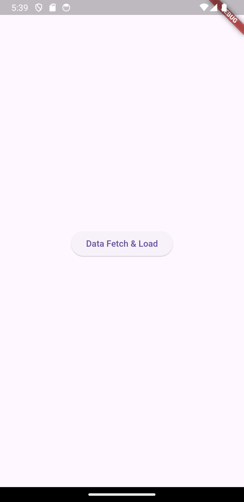

# 교차로 보행자 신호등 잔여시간 표시 어플리케이션

본 프로젝트는 서울시 교차로 신호제어기의 잔여시간, 신호정보 API를 이용하여 보행자 신호 잔여시간을 제공하는 프로젝트이다. 

모든 보행자 신호등에서 잔여시간이 표기 되는 것이 아니기에 해당 어플리케이션을 사용한다면 자전거 및 보행자에게 더 효율적이고 합리적인 판단을 제공할 수 있다 생각하였다. 

또한 백그라운드 플로팅 기능(어플을 끄더라도 화면에 작게 어플의 상태가 표시되는 것)을 추가한다면으로 다른 동작을 하면서 신호등을 굳이 확인 안하더라도 근처 횡단보도의 상태를 확인할 수 있을 것이라 생각했다. 

더 나아가 만약 이것이 성공적으로 수행된다면 보행자 뿐만 아니라 차량 운전자에게도 제공하여 신호 상황 및 잔여시간을 알려준다면 사회적 효용이 증가하지 않을까 생각하였다. 

# 해당 프로젝트의 문제점 

우선 근처 교차로 id를 query하여 api를 호출해야하기 때문에 불가피하게 api 호출 시간이 발생한다. 

이는 실험을 해본 결과 최소 7초에서 최대 11초 정도 소요되었다. 

만약 api가 REST API 형식이 아닌 실시간 성을 지원을 해줬다면 지속적인 변화를 관찰하고 현재 시간과 싱크로를 맞춰 실제 상용 가능했을 것 같다

REST API를 이용하여 실시간 성을 가지게 하는 방식도 시도해보았지만 
1. 지속적으로 API를 계속 호출할 수 없는 점
2. 너무 많은 부분을 신경써야하고 그럼에도 완벽한 오류 및 사각지대가 존재한다는 점 

에서 기능적인 완벽성을 포기하고 약간의 시간 딜레이를 감수하고 해당 프로젝트를 끝마치기로 결심하였다

추가적으로 API에서 초록불 및 빨간불의 잔여시간 정보를 제공할 것을 요청하였지만 해당 값이 제공되지 않기에 추가하기 어렵다는 답변을 받았다. 

(만약 잔여시간이 추가된다면 API를 통해서가 아니라 임의적으로 기기에서 시간을 계산하여 실시간성을 맞출 수 있을 것이라 생각하였다)

# version

현재는 V1, V2로 개발을 마무리한 상태이다. 
V1은 아직 코드 자체를 깔끔하게 수정하지는 못하였다. 

현재 master 브랜치가 V1, lab 브랜치가 V2인 상황

V1은 일반적인 sqlite 데이터베이스를 사용하여 사용자의 근처 교차로 id를 query 한다. 교차로 API이므로 보통 북/동/남/서, 북동/남동/남서/북서 이렇게 4개의 값을 받아올 수 있는데 4개의 신호정보를 화면에 출력하고 스마트 기기의 회전에 따라 해당 정보를 보정되게 구현하였다. 

즉, 교차로의 모든 보행자 신호정보를 출력하고 사용자가 바라보는 방향에 따라 해당 신호정보를 회전 시킴으로서 일관성 있는 위치를 파악할 수 있게 하였다. 

하지만 이 부분은 교차로의 신호를 전부 파악하고 흐름을 이해하려는 사람에게는 유용하지만 현실 세계의 사용자에게 효율적으로 받아들일 수 없을 것 같았다. 

또한 지속적인 query를 해야하는 상황에서 비효율적인 리소스 낭비가 있을 것이라 판단하여 

V1를 개선한 V2를 개발하기로 결심하였다. 

V2는 4개의 신호정보 중 사용자와 가장 가까운 방향의 신호등만 화면에 표시되도록 UI를 단순하게 개변하였다. 그리고 spatial index를 이용한 rtree를 통해서 공간 데이터를 훨씬 더 효율적으로 query할 수 있게 기능을 변경하였다. 

# V2의 작동원리 

최신 버전인 V2에 대해 설명하자면 현재 위치를 중심으로 가상의 사각형 영역을 설정하여 이 범위 안에 교차로 데이터가 있는지 없는지를 지속적으로 query한다. 

그렇게 도출한 교차로 id와 위치정보, 그리고 현재 사용자의 위치 정보를 비교하여 현재 어떤 방위각에 사용자가 존재하는지를 파악하고 해당 방위각에 맞는 신호 정보만을 화면에 출력하는 식으로 작동하게 된다. 

만일 사용자의 방위각이 이동되어 다른 신호정보를 원한다고 하면 해당 신호 정보로 변경해준다. 

# 실행 화면 
## Data Fetch Screen

## Default Screen

## Light Screen

